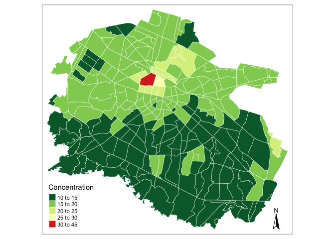
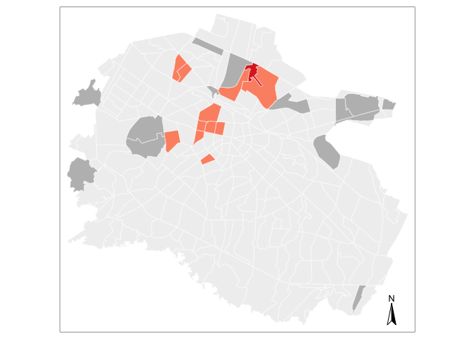

2\) Mapping
================

\*\*\* Produces all the maps in the dissertation \*\*\*

\*\*\* Required data: morpho + pol\_dj + pol\_nfm. For detailed
explanation: see 1
\*\*\*

# Households burning solid fuels

``` r
# Calculating the proportion of households burning solid fuels by dividing the
# total number of such households by the total number of households

morpho$prop_nafta <- morpho$NJ17_eq4i_ / morpho$NN_HouseH_

morpho$prop_nafta[morpho$prop_nafta == "NaN"] <- "0" #values that are NaN, correspond to zeros
# Those correpond to neighbourhoods where there are no households, dividing by zero generates NaN 

morpho$prop_nafta <- as.numeric(morpho$prop_nafta)
morpho$prop_nafta <- morpho$prop_nafta*100
mapnafta <- tm_shape(morpho) + 
  tm_fill("prop_nafta", 
          style = "fixed", 
          breaks=c(0, 20, 40, 60, 80, 100), 
          palette = c("#f7f7f7", "#cccccc", "#969696", 
                      "#636363", "#252525"),
          title = "Proportion (%)") +
  tm_borders("white", alpha=.5) + 
  tm_compass() 
tmap_mode(mode = c("plot", "view"))
```

    ## tmap mode set to plotting

``` r
mapnafta
```

<!-- -->

# PM pollution December-January

``` r
# aggregating the pollution data for Dec-Jan by sensor (using the mean)
sensors_agg_dj <- aggregate(pol_dj, list(pol_dj$geohash), mean)

# Calculate range of shapefile 
# We will use the administrative boundaries in the morphology data
# We convert the latter to SP (from SF)
morpho_sp <- as(morpho, 'Spatial')

box <- bbox(morpho_sp)
x.range <- as.integer(box[1,])
y.range <- as.integer(box[2,])

# Create a grid from the values in points df. 
# Expand range to a grid with spacing that we would like to use in interpolation
# Here we will use 200m grid cells
grd <- expand.grid(x=seq(from=x.range[1], to=x.range[2], by=200), y=seq(from=y.range[1], to=y.range[2], by=200))
# Convert grid to SpatialPixel class
coordinates(grd) <- ~ x+y
gridded(grd) <- TRUE

# Assigning the projection of the pollution data to the grid. 
proj4string(grd) <- proj4string(morpho_sp)

# convert sensor data to sp 
sensors_agg_dj_sp <-  as(sensors_agg_dj , 'Spatial')
# Inverse-distance interpolation
idw<-idw(formula= P2~1, locations=sensors_agg_dj_sp, newdata=grd)

# Transforming the interpolated data to raster
ras <- raster(idw)
# Clip the raster to Sofia outline
rasmask <- mask(ras, morpho_sp)

# Calculating mean P2.5 pollution per neighbourhood
av2.5 <- raster::extract(rasmask, morpho_sp, fun=mean, na.rm=TRUE)

morpho_dj <- morpho # in order to not edit the original city morphology data
morpho_dj$P2 <- unlist(av2.5)

morpho_dj$P2 <- as.vector(morpho_dj$P2)


# mapping interpolated PM2.5 concentrations per neighbourhood
library(tmap)
map_inter <- tm_shape(morpho_dj) + 
  tm_fill("P2", 
          style = "fixed", 
          breaks=c(15, 20, 25, 30, 35, 40, 45, 50), 
          palette = c("#91cf60", "#d9ef8b", "#ffffbf", 
                      "#fee08b", "#fc8d59", "#d73027", "#a50026"),
          title = "Concentration") +
  tm_borders("white", alpha=.5) + 
  tm_compass() 
```

Mapping the interpolated data:

``` r
map_inter
```

<!-- --> And the
location of the sensors used in the interpolation / kept for Dec-Jan:

``` r
plot(morpho_sp)
plot(sensors_agg_dj, col="red", add=TRUE, pch=1, cex=1)
```

    ## Warning in plot.sf(sensors_agg_dj, col = "red", add = TRUE, pch = 1, cex = 1):
    ## ignoring all but the first attribute

<!-- -->

# PM pollution November-February-March

``` r
sensors_agg_nfm <- aggregate(pol_nfm, list(pol_nfm$geohash), mean)

# using the old grid 
# convert sensor data to sp 
sensors_agg_nfm_sp <-  as(sensors_agg_nfm  , 'Spatial')
# Inverse-distance interpolation
idw<-idw(formula= P2~1, locations=sensors_agg_nfm_sp, newdata=grd) #using the grid created in the previous section

# Transforming the interpolated data to raster
ras <- raster(idw)
# Clip the raster to Sofia outline
rasmask <- mask(ras, morpho_sp)

# Calculating mean P2.5 pollution per neighbourhood
av2.5 <- raster::extract(rasmask, morpho_sp, fun=mean, na.rm=TRUE)

moprho_nfm <- morpho 
moprho_nfm$P2 <- unlist(av2.5)
# Since this data is ordered with our polygons we can just assign it into a new variable 'av2.5".
# shapes_sp@data$av2.5 <- unlist(raster::extract(rasmask, shapes_sp, fun=mean, na.rm=TRUE))
#shapes_sp@data$av2.5 <- as.vector(shapes_sp@data$av2.5)

moprho_nfm$P2 <- as.vector(moprho_nfm$P2)

min(moprho_nfm$P2 ) # 10 
max(moprho_nfm$P2 ) # 42

# mapping interpolated PM2.5 concentrations per neighbourhood
#slighly better map:
map_inter <- tm_shape(moprho_nfm) + 
  tm_fill("P2", 
          style = "fixed", 
          breaks=c(10, 15, 20, 25, 30, 45), 
          palette = c("#006837", "#91cf60", "#d9ef8b", "#ffffbf", "#d73027"),
          title = "Concentration") +
  tm_borders("white", alpha=.5) + 
  tm_compass() 
```

``` r
map_inter
```

<!-- -->

# Discrepancy between pollution hotspots and hotspots of solid fuel burning

``` r
morpho_dj$match <- ifelse(morpho_dj$P2>35, 1, 0) #areas that are pollution hotposts 
morpho_dj$match <- ifelse(morpho_dj$prop_nafta>66, 2, morpho_dj$match) # areas that are hotspots of solid fuel burning 
morpho_dj$match <- ifelse(morpho_dj$P2>35 & morpho_dj$prop_nafta>66, 3, morpho_dj$match) # creating a variables that compares if a pollution hotspot is also a hotspot of solid fuel burning

morpho_dj$match <- as.factor(morpho_dj$match)

map_disc <- tm_shape(morpho_dj) + 
  tm_fill("match", 
          style = "fixed", 
          breaks=c(0, 1, 2, 3), 
          palette = c("#f0f0f0", "#fc9272", "#bdbdbd", "#de2d26"), 
          legend.show=F) + 
          #title = "Concentration (μg/m3)") +
  tm_borders("white", alpha=.5) + 
  tm_compass() 
```

``` r
map_disc
```

<!-- -->
