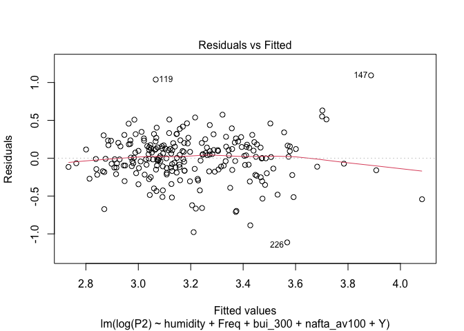
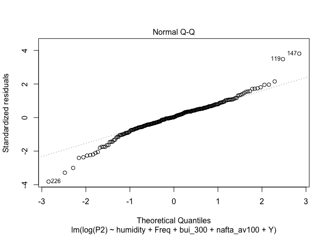
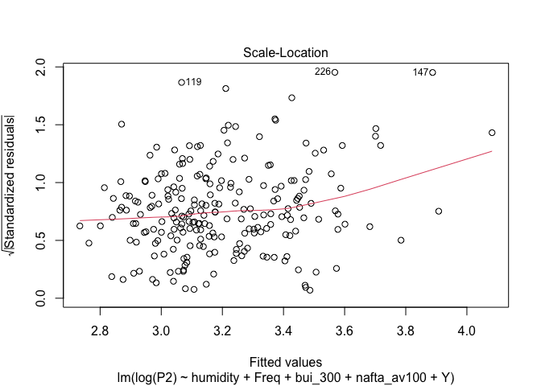
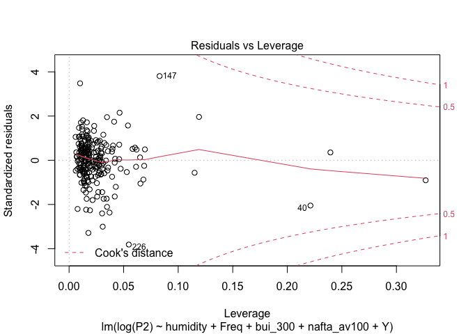
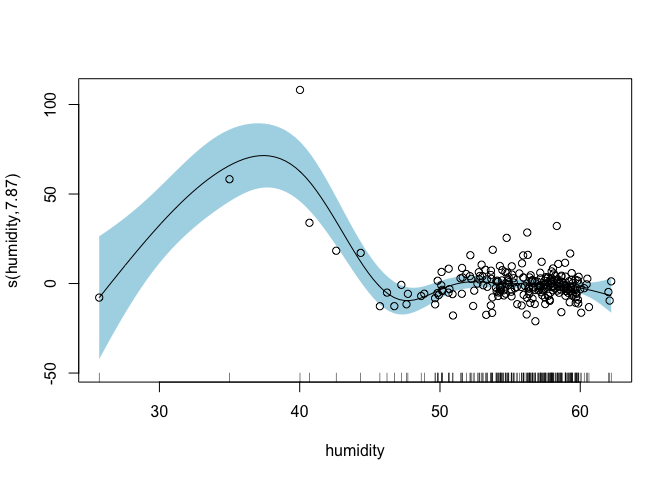
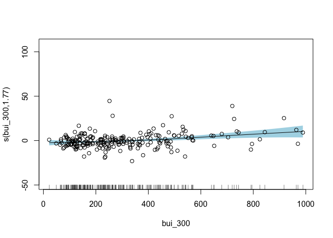
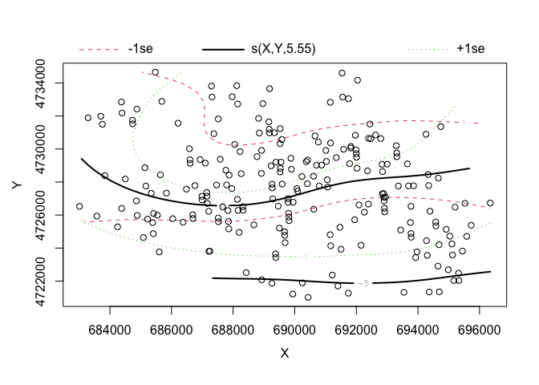
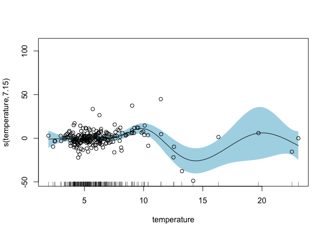
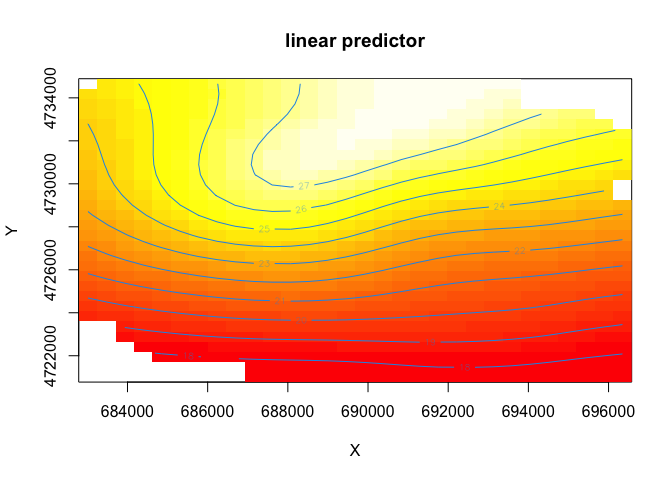
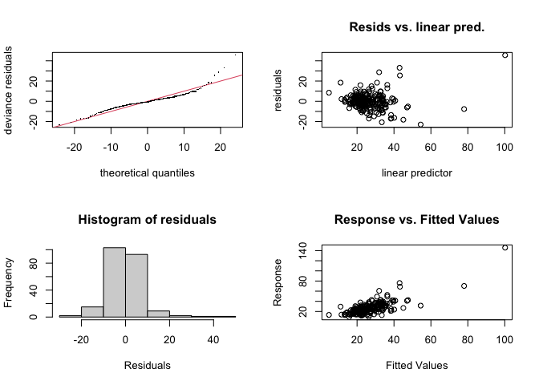

4\) Land Use Regression
================

NB: need the ‘winterpol7 data’ (from file 3)

# Linear regression

### Cleaning the data (“winterpol7”)

We remove missing values (we do a complete case analysis)

``` r
dj <- winterpol7
dj <- dj[complete.cases(dj), ] 
```

### Forward stepwise selection

\*\*\* Will underfit the model \*\*\*

``` r
full.model <- lm(log(P2) ~., data = dj)

step.model <- stepAIC(full.model, direction = "forward", 
                      trace = FALSE)
```

``` r
summary(step.model)
```

    ## 
    ## Call:
    ## lm(formula = log(P2) ~ temperature + humidity + pressure + Freq + 
    ##     com_area100 + ind_area100 + res_area100 + gre_area100 + com_area300 + 
    ##     ind_area300 + res_area300 + gre_area300 + com_area500 + ind_area500 + 
    ##     res_area500 + gre_area500 + com_area1000 + ind_area1000 + 
    ##     res_area1000 + gre_area1000 + pri_len25 + sec_len25 + ter_len25 + 
    ##     unc_len25 + pri_len50 + sec_len50 + ter_len50 + unc_len50 + 
    ##     tru_len100 + pri_len100 + sec_len100 + ter_len100 + unc_len100 + 
    ##     tru_len300 + pri_len300 + sec_len300 + ter_len300 + unc_len300 + 
    ##     tru_len500 + pri_len500 + sec_len500 + ter_len500 + unc_len500 + 
    ##     mot_len1000 + tru_len1000 + pri_len1000 + sec_len1000 + ter_len1000 + 
    ##     unc_len1000 + flat_av100 + flo_av100 + central_av100 + electric_av100 + 
    ##     nafta_av100 + hh_av100 + ppl_av100 + pop_100 + bui_100 + 
    ##     flat_av300 + flo_av300 + central_av300 + electric_av300 + 
    ##     nafta_av300 + hh_av300 + ppl_av300 + pop_300 + bui_300 + 
    ##     flo_av50 + bui_50 + flo_av25 + bui_25 + alt25 + X + Y, data = dj)
    ## 
    ## Residuals:
    ##      Min       1Q   Median       3Q      Max 
    ## -1.02831 -0.13133  0.00328  0.14842  0.83378 
    ## 
    ## Coefficients: (6 not defined because of singularities)
    ##                  Estimate Std. Error t value Pr(>|t|)    
    ## (Intercept)    -1.369e+01  9.138e+01  -0.150  0.88109    
    ## temperature    -2.082e-02  1.250e-02  -1.665  0.09788 .  
    ## humidity       -2.960e-02  8.082e-03  -3.663  0.00034 ***
    ## pressure        4.968e-05  5.513e-05   0.901  0.36885    
    ## Freq            3.537e-04  7.452e-05   4.747 4.62e-06 ***
    ## com_area100    -5.120e-06  1.152e-05  -0.445  0.65722    
    ## ind_area100     2.207e-06  1.657e-05   0.133  0.89426    
    ## res_area100     2.782e-06  6.169e-06   0.451  0.65265    
    ## gre_area100    -6.603e-06  9.591e-06  -0.689  0.49215    
    ## com_area300     2.050e-06  3.788e-06   0.541  0.58923    
    ## ind_area300    -1.281e-08  4.235e-06  -0.003  0.99759    
    ## res_area300     9.770e-07  1.661e-06   0.588  0.55732    
    ## gre_area300     1.520e-06  1.767e-06   0.861  0.39081    
    ## com_area500    -8.374e-07  1.643e-06  -0.510  0.61109    
    ## ind_area500    -8.717e-08  1.457e-06  -0.060  0.95238    
    ## res_area500    -1.214e-06  6.408e-07  -1.894  0.06005 .  
    ## gre_area500    -5.291e-07  6.811e-07  -0.777  0.43841    
    ## com_area1000    5.060e-08  3.321e-07   0.152  0.87908    
    ## ind_area1000    3.303e-08  2.025e-07   0.163  0.87064    
    ## res_area1000    2.150e-07  1.045e-07   2.057  0.04131 *  
    ## gre_area1000   -9.072e-08  1.149e-07  -0.790  0.43088    
    ## pri_len25       2.122e-03  4.582e-03   0.463  0.64391    
    ## sec_len25      -6.868e-03  5.380e-03  -1.277  0.20363    
    ## ter_len25       6.945e-04  3.614e-03   0.192  0.84785    
    ## unc_len25              NA         NA      NA       NA    
    ## pri_len50      -1.912e-03  1.882e-03  -1.015  0.31147    
    ## sec_len50       3.090e-03  2.047e-03   1.509  0.13321    
    ## ter_len50      -1.279e-04  1.747e-03  -0.073  0.94171    
    ## unc_len50              NA         NA      NA       NA    
    ## tru_len100      8.993e-04  1.270e-03   0.708  0.47988    
    ## pri_len100      6.730e-04  5.413e-04   1.243  0.21557    
    ## sec_len100     -2.414e-04  4.983e-04  -0.485  0.62867    
    ## ter_len100     -5.024e-04  6.160e-04  -0.816  0.41596    
    ## unc_len100             NA         NA      NA       NA    
    ## tru_len300      1.363e-04  2.318e-04   0.588  0.55756    
    ## pri_len300      3.078e-07  1.013e-04   0.003  0.99758    
    ## sec_len300      7.076e-05  1.232e-04   0.574  0.56657    
    ## ter_len300      1.476e-04  1.323e-04   1.116  0.26606    
    ## unc_len300             NA         NA      NA       NA    
    ## tru_len500     -7.459e-05  1.084e-04  -0.688  0.49255    
    ## pri_len500     -7.860e-05  5.627e-05  -1.397  0.16446    
    ## sec_len500     -1.146e-05  6.550e-05  -0.175  0.86135    
    ## ter_len500     -5.484e-05  7.486e-05  -0.733  0.46493    
    ## unc_len500             NA         NA      NA       NA    
    ## mot_len1000    -6.838e-04  6.040e-04  -1.132  0.25936    
    ## tru_len1000    -1.834e-06  2.863e-05  -0.064  0.94901    
    ## pri_len1000     1.920e-05  1.287e-05   1.492  0.13770    
    ## sec_len1000    -1.333e-05  1.604e-05  -0.831  0.40716    
    ## ter_len1000     1.672e-05  2.412e-05   0.693  0.48917    
    ## unc_len1000            NA         NA      NA       NA    
    ## flat_av100      6.258e-04  4.703e-03   0.133  0.89431    
    ## flo_av100      -6.608e-02  4.619e-02  -1.431  0.15452    
    ## central_av100   4.533e-02  2.855e-02   1.588  0.11438    
    ## electric_av100  3.553e-02  3.591e-02   0.989  0.32399    
    ## nafta_av100     2.403e-01  1.937e-01   1.240  0.21672    
    ## hh_av100       -1.045e-02  1.403e-02  -0.745  0.45719    
    ## ppl_av100      -1.152e-02  9.339e-03  -1.233  0.21935    
    ## pop_100        -1.136e-04  1.332e-04  -0.853  0.39486    
    ## bui_100        -3.686e-03  2.559e-03  -1.440  0.15175    
    ## flat_av300     -3.175e-04  9.824e-03  -0.032  0.97426    
    ## flo_av300       7.781e-02  7.107e-02   1.095  0.27526    
    ## central_av300  -9.672e-02  6.027e-02  -1.605  0.11057    
    ## electric_av300 -1.151e-01  8.390e-02  -1.372  0.17188    
    ## nafta_av300     1.621e-03  3.261e-01   0.005  0.99604    
    ## hh_av300        1.742e-02  3.708e-02   0.470  0.63912    
    ## ppl_av300       3.269e-02  2.296e-02   1.424  0.15644    
    ## pop_300         4.707e-06  2.736e-05   0.172  0.86361    
    ## bui_300         9.395e-04  2.905e-04   3.234  0.00149 ** 
    ## flo_av50        1.984e-02  2.593e-02   0.765  0.44537    
    ## bui_50          7.250e-03  7.181e-03   1.010  0.31420    
    ## flo_av25        1.930e-02  1.317e-02   1.466  0.14467    
    ## bui_25         -2.614e-03  1.230e-02  -0.213  0.83190    
    ## alt25          -3.888e-04  3.851e-04  -1.009  0.31430    
    ## X              -1.997e-05  1.535e-05  -1.300  0.19536    
    ## Y               5.799e-06  1.850e-05   0.313  0.75440    
    ## ---
    ## Signif. codes:  0 '***' 0.001 '**' 0.01 '*' 0.05 '.' 0.1 ' ' 1
    ## 
    ## Residual standard error: 0.3034 on 157 degrees of freedom
    ## Multiple R-squared:  0.5403, Adjusted R-squared:  0.3412 
    ## F-statistic: 2.713 on 68 and 157 DF,  p-value: 1.569e-07

4 significant predictors (5%): humidity, number of recordings,
residential area (1000m), building density (300m). Solid fuel burning
(at any buffer size) is not even significant at the 10% level Adjusted
R-squared = 0.34 NB: in the model, number of recordings is under the
name ‘Freq’

### Backward stepwise selection

\*\*\* Will overfit the model \*\*\*

``` r
step.model <- stepAIC(full.model, direction = "backward", 
                      trace = FALSE)
```

``` r
summary(step.model)
```

    ## 
    ## Call:
    ## lm(formula = log(P2) ~ temperature + humidity + pressure + Freq + 
    ##     res_area500 + res_area1000 + gre_area1000 + tru_len300 + 
    ##     tru_len500 + pri_len500 + pri_len1000 + sec_len1000 + central_av100 + 
    ##     nafta_av100 + ppl_av100 + ppl_av300 + bui_300 + flo_av25 + 
    ##     alt25 + X, data = dj)
    ## 
    ## Residuals:
    ##      Min       1Q   Median       3Q      Max 
    ## -1.00202 -0.14297  0.01027  0.15593  1.01750 
    ## 
    ## Coefficients:
    ##                 Estimate Std. Error t value Pr(>|t|)    
    ## (Intercept)    1.158e+01  6.441e+00   1.798   0.0737 .  
    ## temperature   -1.857e-02  1.066e-02  -1.743   0.0828 .  
    ## humidity      -2.873e-02  6.710e-03  -4.282 2.85e-05 ***
    ## pressure       7.652e-05  3.351e-05   2.284   0.0234 *  
    ## Freq           3.569e-04  5.864e-05   6.087 5.59e-09 ***
    ## res_area500   -4.800e-07  1.739e-07  -2.760   0.0063 ** 
    ## res_area1000   1.616e-07  6.323e-08   2.555   0.0113 *  
    ## gre_area1000  -1.444e-07  5.583e-08  -2.586   0.0104 *  
    ## tru_len300     2.910e-04  1.683e-04   1.729   0.0853 .  
    ## tru_len500    -1.374e-04  6.716e-05  -2.046   0.0420 *  
    ## pri_len500    -6.397e-05  2.899e-05  -2.207   0.0285 *  
    ## pri_len1000    1.811e-05  9.491e-06   1.909   0.0577 .  
    ## sec_len1000   -1.626e-05  7.249e-06  -2.244   0.0259 *  
    ## central_av100  1.544e-02  8.109e-03   1.904   0.0583 .  
    ## nafta_av100    2.256e-01  1.012e-01   2.229   0.0269 *  
    ## ppl_av100     -5.797e-03  2.941e-03  -1.971   0.0501 .  
    ## ppl_av300      2.479e-03  1.779e-03   1.394   0.1649    
    ## bui_300        5.839e-04  1.415e-04   4.126 5.38e-05 ***
    ## flo_av25       1.610e-02  8.052e-03   1.999   0.0469 *  
    ## alt25         -3.961e-04  2.333e-04  -1.698   0.0910 .  
    ## X             -2.040e-05  8.172e-06  -2.497   0.0133 *  
    ## ---
    ## Signif. codes:  0 '***' 0.001 '**' 0.01 '*' 0.05 '.' 0.1 ' ' 1
    ## 
    ## Residual standard error: 0.2822 on 205 degrees of freedom
    ## Multiple R-squared:  0.4807, Adjusted R-squared:   0.43 
    ## F-statistic: 9.488 on 20 and 205 DF,  p-value: < 2.2e-16

13 ignificant predictors (5% level): humidity, pressure, number of
recordings, residential area (1000m), green area (1000m), trunk length
(500m), primary road length (500m), secondary road length (1000m), solid
fuel burning (100m), building density (300m), average number of floors
(25m), X coordinate

### Final LR

After some toying we select the final model, explained in detail in the
dissertation:

``` r
mod <- lm(log(P2)~humidity + Freq + bui_300 +  nafta_av100+ Y, data=dj) 
```

``` r
summary(mod)
```

    ## 
    ## Call:
    ## lm(formula = log(P2) ~ humidity + Freq + bui_300 + nafta_av100 + 
    ##     Y, data = dj)
    ## 
    ## Residuals:
    ##      Min       1Q   Median       3Q      Max 
    ## -1.11218 -0.14766  0.00658  0.16444  1.09396 
    ## 
    ## Coefficients:
    ##               Estimate Std. Error t value Pr(>|t|)    
    ## (Intercept) -1.691e+02  3.443e+01  -4.910 1.77e-06 ***
    ## humidity    -1.876e-02  4.604e-03  -4.075 6.43e-05 ***
    ## Freq         3.974e-04  5.975e-05   6.650 2.28e-10 ***
    ## bui_300      3.310e-04  1.092e-04   3.031  0.00273 ** 
    ## nafta_av100  1.647e-01  9.357e-02   1.760  0.07973 .  
    ## Y            3.659e-05  7.278e-06   5.027 1.03e-06 ***
    ## ---
    ## Signif. codes:  0 '***' 0.001 '**' 0.01 '*' 0.05 '.' 0.1 ' ' 1
    ## 
    ## Residual standard error: 0.2999 on 220 degrees of freedom
    ## Multiple R-squared:  0.3707, Adjusted R-squared:  0.3564 
    ## F-statistic: 25.92 on 5 and 220 DF,  p-value: < 2.2e-16

### Linearity, normality and homoscedasticity

NB: Ignore the fourth
plot

``` r
plot(mod) 
```

<!-- --><!-- --><!-- --><!-- -->

### Multicollinearity

``` r
vif(mod)
```

    ##    humidity        Freq     bui_300 nafta_av100           Y 
    ##    1.037677    1.009676    1.133993    1.094921    1.226417

### Independent error terms

Durbin watson statistic:

``` r
durbinWatsonTest(mod) 
```

    ##  lag Autocorrelation D-W Statistic p-value
    ##    1      0.09395498      1.748901   0.026
    ##  Alternative hypothesis: rho != 0

### Cross-Validation

k-fold (k=10)

``` r
# (using library 'caret')

# Define training control
train.control <- trainControl(method = "cv", number = 10)
# Train the model
model <- train(log(P2)~humidity + Freq +bui_300 +  nafta_av100+ Y, data = dj, method = "lm", trControl = train.control)
```

``` r
# Summarize the results
print(model)
```

    ## Linear Regression 
    ## 
    ## 226 samples
    ##   5 predictor
    ## 
    ## No pre-processing
    ## Resampling: Cross-Validated (10 fold) 
    ## Summary of sample sizes: 202, 204, 203, 202, 202, 205, ... 
    ## Resampling results:
    ## 
    ##   RMSE       Rsquared   MAE     
    ##   0.3012008  0.3567067  0.223023
    ## 
    ## Tuning parameter 'intercept' was held constant at a value of TRUE

# Generalised Additive Model

\*\*\* The GAM is based on the mgcv package \*\*\*

``` r
library(mgcv)
```

    ## Loading required package: nlme

    ## 
    ## Attaching package: 'nlme'

    ## The following object is masked from 'package:raster':
    ## 
    ##     getData

    ## The following object is masked from 'package:dplyr':
    ## 
    ##     collapse

    ## This is mgcv 1.8-31. For overview type 'help("mgcv-package")'.

Since we could not find a selection method to select the significant
variables, we used the significant variables of LR, adding and removing
some.

``` r
mod_gam <- gam(P2 ~ s(humidity) + Freq + s(bui_300) + s(X,Y) + nafta_av100 +s(temperature), data=dj, method='REML')
```

### Linear and smooth terms

``` r
summary(mod_gam)
```

    ## 
    ## Family: gaussian 
    ## Link function: identity 
    ## 
    ## Formula:
    ## P2 ~ s(humidity) + Freq + s(bui_300) + s(X, Y) + nafta_av100 + 
    ##     s(temperature)
    ## 
    ## Parametric coefficients:
    ##             Estimate Std. Error t value Pr(>|t|)    
    ## (Intercept) 19.22320    1.14826  16.741  < 2e-16 ***
    ## Freq         0.01206    0.00179   6.738 1.66e-10 ***
    ## nafta_av100  5.95156    2.80331   2.123    0.035 *  
    ## ---
    ## Signif. codes:  0 '***' 0.001 '**' 0.01 '*' 0.05 '.' 0.1 ' ' 1
    ## 
    ## Approximate significance of smooth terms:
    ##                  edf Ref.df     F  p-value    
    ## s(humidity)    7.871  8.657 9.257 1.15e-11 ***
    ## s(bui_300)     1.769  2.202 6.503  0.00177 ** 
    ## s(X,Y)         5.551  7.806 2.325  0.02182 *  
    ## s(temperature) 7.150  8.019 4.097  0.00013 ***
    ## ---
    ## Signif. codes:  0 '***' 0.001 '**' 0.01 '*' 0.05 '.' 0.1 ' ' 1
    ## 
    ## R-sq.(adj) =  0.559   Deviance explained = 60.7%
    ## -REML = 826.68  Scale est. = 71.832    n = 226

### Partial effects plot

``` r
plot(mod_gam, rug = TRUE, residuals = TRUE, pch = 1, cex = 1, pages=4, shade = TRUE, shade.col = "lightblue")
```

<!-- --><!-- --><!-- --><!-- -->

### Spatial interaction

``` r
vis.gam(mod_gam, view = c("X", "Y"), plot.type = "contour", too.far = 0.15)
```

<!-- -->

### Number of basis functions

None of the p-values associated with the smooth terms are significant,
implying that there are enough basis functions for each smooth term.
Each smooth term has 9 basis functions, except for the interaction,
which has 29.

``` r
gam.check(mod_gam)
```

<!-- -->

    ## 
    ## Method: REML   Optimizer: outer newton
    ## full convergence after 8 iterations.
    ## Gradient range [-2.30073e-05,1.291894e-05]
    ## (score 826.6786 & scale 71.83156).
    ## Hessian positive definite, eigenvalue range [0.1416885,109.2273].
    ## Model rank =  59 / 59 
    ## 
    ## Basis dimension (k) checking results. Low p-value (k-index<1) may
    ## indicate that k is too low, especially if edf is close to k'.
    ## 
    ##                   k'   edf k-index p-value
    ## s(humidity)     9.00  7.87    1.09    0.91
    ## s(bui_300)      9.00  1.77    0.95    0.18
    ## s(X,Y)         29.00  5.55    1.06    0.79
    ## s(temperature)  9.00  7.15    1.11    0.94

### Concurvity

Since concurvity is complex, the function reports three different ways
of measuring concurvity. Each is better in some situations. What is
important is that you should always look at the worst case, and if the
value is high (say, over 0.8), inspect your model more
    carefully.

``` r
concurvity(mod_gam, full = TRUE) 
```

    ##               para s(humidity) s(bui_300)    s(X,Y) s(temperature)
    ## worst    0.7849523   0.9439393  0.6865390 0.6862254      0.9447195
    ## observed 0.7849523   0.7095670  0.5345066 0.3334357      0.5541275
    ## estimate 0.7849523   0.7503547  0.5051362 0.2563638      0.6349767

Here, humidity and concurvity have high concurvity (above 0.8)

This is why, we use the second mode of the function, setting full =
FALSE. With full = FALSE, the function returns matrices of pairwise
concurvities. These show the degree to which each variable is
predetermined by each other variable, rather than all the other
variables.

``` r
concurvity(mod_gam, full = FALSE) 
```

    ## $worst
    ##                        para  s(humidity)   s(bui_300)       s(X,Y)
    ## para           1.000000e+00 3.133592e-26 3.416205e-25 1.281358e-24
    ## s(humidity)    3.113539e-26 1.000000e+00 1.015152e-01 2.952698e-01
    ## s(bui_300)     3.422336e-25 1.015152e-01 1.000000e+00 6.450445e-01
    ## s(X,Y)         1.286829e-24 2.952698e-01 6.450445e-01 1.000000e+00
    ## s(temperature) 7.040805e-25 9.255759e-01 1.079594e-01 2.907758e-01
    ##                s(temperature)
    ## para             7.075587e-25
    ## s(humidity)      9.255759e-01
    ## s(bui_300)       1.079594e-01
    ## s(X,Y)           2.907758e-01
    ## s(temperature)   1.000000e+00
    ## 
    ## $observed
    ##                        para  s(humidity)   s(bui_300)       s(X,Y)
    ## para           1.000000e+00 6.130941e-28 2.728129e-31 2.620092e-28
    ## s(humidity)    3.113539e-26 1.000000e+00 3.553328e-02 4.630316e-02
    ## s(bui_300)     3.422336e-25 1.062378e-02 1.000000e+00 1.693486e-01
    ## s(X,Y)         1.286829e-24 1.198639e-01 4.619070e-01 1.000000e+00
    ## s(temperature) 7.040805e-25 6.497421e-01 4.033451e-02 8.662075e-02
    ##                s(temperature)
    ## para             1.800673e-27
    ## s(humidity)      4.550823e-01
    ## s(bui_300)       3.296211e-02
    ## s(X,Y)           1.030934e-01
    ## s(temperature)   1.000000e+00
    ## 
    ## $estimate
    ##                        para  s(humidity)   s(bui_300)       s(X,Y)
    ## para           1.000000e+00 2.008643e-28 8.440708e-28 1.821044e-26
    ## s(humidity)    3.113539e-26 1.000000e+00 3.631746e-02 5.343592e-02
    ## s(bui_300)     3.422336e-25 3.357320e-02 1.000000e+00 1.092096e-01
    ## s(X,Y)         1.286829e-24 1.165469e-01 4.336127e-01 1.000000e+00
    ## s(temperature) 7.040805e-25 6.812935e-01 3.910856e-02 7.117265e-02
    ##                s(temperature)
    ## para             3.044971e-27
    ## s(humidity)      5.245229e-01
    ## s(bui_300)       4.351278e-02
    ## s(X,Y)           1.687117e-01
    ## s(temperature)   1.000000e+00

None of the values are high, which means there is no issue of
concurvity.

### Cross-Validation

The CV used the archived ‘gamclass’package. The package was downloaded
onto a local device and read in ’manually’ in R.

##### Installing gamclass

``` r
# using the link of the CRAN archive:
#url <- "https://cran.r-project.org/src/contrib/Archive/gamclass/gamclass_0.58.tar.gz"
#pkgFile <- "gamclass_0.58.tar.gz"
#download.file(url = url, destfile = pkgFile)

# Install dependencies:
#install.packages(c("ada", "ipred", "evd"))

# Install package
#install.packages(pkgs=pkgFile, type="source", repos=NULL)
```

``` r
library(gamclass)
```

##### CV test

``` r
CVgam(formula = (P2 ~ s(humidity) + Freq + s(bui_300) + s(X,Y) + nafta_av100 +s(temperature)), data=dj, nfold = 10, debug.level = 0, method = "REML", printit=TRUE, cvparts = NULL, gamma=1)
```

    ##    GAMscale CV-mse-GAM  
    ##     71.8316    290.0268
